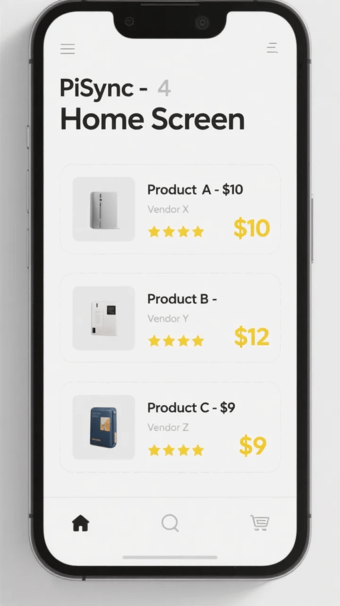

```
# PiSync 💱📊

PiSync is a **Decentralized Price Comparison & Vendor Trust Platform** built for the **Pi Network** ecosystem.  
It allows users to compare product prices across vendors, build vendor trust, and experience decentralized shopping.

## 🌟 Features
- 🔍 Price Comparison – Easily compare products from different vendors  
- 👨‍👩‍👧 Vendor Trust – Vendors are rated & reviewed by the community  
- 📱 Cross-platform App – Built with React Native for mobile  
- ⚡ API Backend – Node.js + Express backend for secure data handling  
- 🌎 Decentralized Vision – Designed for the Pi Network ecosystem  

## 📂 Project Structure
PiSync-v2/
│
├── backend/         # Node.js + Express backend
│   ├── server.js    # Main server code
│   └── data/
│       └── products.json
│
├── frontend/        # React Native frontend
│   ├── App.js
│   └── src/screens/
│       ├── HomeScreen.js
│       ├── VendorScreen.js
│       └── CompareScreen.js
│
├── README.md
├── README_EN.md
└── README_TR.md

## ⚙️ Installation
# 1. Clone the Repository
git clone https://github.com/umutcetiner07/PiSync-v2.git
cd PiSync-v2

# 2. Backend Setup
cd backend
npm install
node server.js   # Backend runs on → http://localhost:5000

# 3. Frontend Setup (React Native)
cd frontend
npm install
npx react-native start


## 📸 Screenshots




## 🤝 Contributing
Contributions, issues, and feature requests are welcome!  
Feel free to fork this repo and submit a pull request 🙌

## 📜 License
This project is licensed under the MIT License.

## 🌐 Multi-Language
- 🇺🇸 README_EN.md  
- 🇹🇷 README_TR.md  
```
